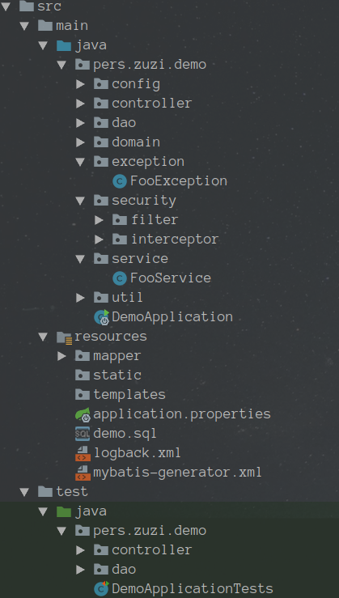

# Maven 构建的 Springboot 项目模板(restful 后端)

## 目的
- 高效的构建一个自己的springboot项目
- 适用于初学者了解springboot

## 项目结构

## 项目构成(依赖)

- MVC服务springboot
- 数据库orm [mybatis](http://www.mybatis.org/mybatis-3/zh/index.html)
- 数据库连接池 [druid](https://github.com/alibaba/druid/wiki)
- 数据库辅助 tk.mapper(通用[mapper](https://github.com/abel533/Mapper/wiki)) 分页插件[pagehelper](https://github.com/pagehelper/Mybatis-PageHelper/blob/master/wikis/zh/HowToUse.md)
- json解析[jackson](https://github.com/FasterXML/jackson-docs)
- 安全验证[jjwt](https://github.com/jwtk/jjwt/blob/master/README.md)+spring security
- api文档[swagger ui](http://springfox.github.io/springfox/docs/current/#springfox-swagger-ui)

## Listen
